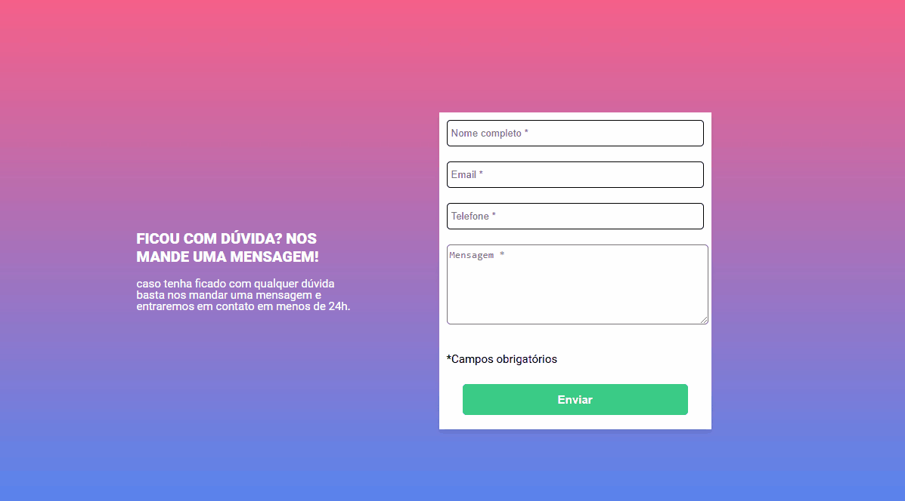

# Formulário
Este projeto cria um formulário que tem inputs de nome, email, telefone e caixa de texto e todos esses campos são obrigatórios 
o preenchimento. Caso seja enviado sem preencher algum campo, aparecerá o alerta de que o campo precisa ser preenchido. Caso seja preenchido corretamente, a borda dos inputs ficará verde para mostrar que foi preenchido corretamente.

## Funcionalidades
<ul>
  <li>Design bonito e moderno</li>
  <li>Efeito visual interativo no botão</li>
  <li>Sistema inteligente para detectar se o campo obrigatório foi preenchido ou não</li>
  <li>Alertas intuitivos, com escrita de campo obrigatório com destaque em vermelho para saber que precisa preencher e detalhes em verde para saber que preencheu correto</li>
</ul>

## Tecnologias utilizadas
HTML5 | CSS | JavaScript

## Desafios
Meus maiores desafios foram:
<ul>
  <li>Colocar a lógica em prática no JavaScript</li>
  <li>Utilizar de forma funcional e limpa as funções do JavaScript</li>
  <li>Fazer o manejo correto das remoções e adições de classes utilizando as propriedades do JavaScript</li>
  <li>Reproduzir o design de um projeto do figma utilizando o HTML e CSS</li>
  <li>Destribuir bem as funções de cada tecnologia</li>
</ul>

## Aprendizados
Meu maior desafios foi utilizar corretamente as funcionalidades do JavaScript, usando os condicionais e os comandos de remoção e adição de classes. Também foi bom para aprender como utilizar cada tecnologia em sua melhor forma, sem deixar que alguma tome o lugar de outra.

## Demonstração

   
Obrigado pela atenção :v
